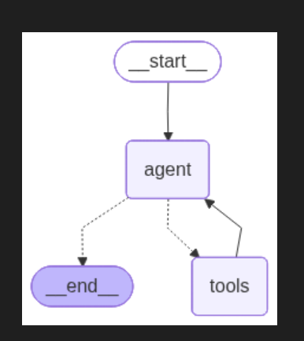

# Trip Planning AI Agent
## By Anupam Chauhan

| Command                                                   | Definition                                                              |
| --------------------------------------------------------- | ----------------------------------------------------------------------- |
| `cd D:`                                                   | Switch to **D:** drive.                                                 |
| `cd D:\Projects\Gen-AI\Trip_Planner_AI_Agent`             | Change directory to the **project folder**.                             |
| `pip install uv`                                          | Install the **`uv` package manager** using pip.                         |
| `uv --version`                                            | Show the **installed uv version**.                                      |
| `uv init`                                                 | Initialize a **new Python project** with `pyproject.toml`.              |
| `uv python list`                                          | List all **available/installed Python versions**.                       |
| `uv python install cpython-3.11.3-windows-x86_64-none`    | Download & install **Python 3.11.3** via uv.                            |
| `uv venv env --python cpython-3.11.3-windows-x86_64-none` | Create a **virtual environment** named `env` using that Python version. |
| `env\Scripts\activate`                                    | **Activate** the virtual environment (Windows).                         |
| `uv pip list`                                             | List **packages installed** in the active environment (via uv’s pip).   |
| `pip install -r requirements.txt`                         | Install **all dependencies** listed in `requirements.txt`.              |

## The Agent Graph

## Demo pics

#Prompt : Plan a trip to Pune for % days 

